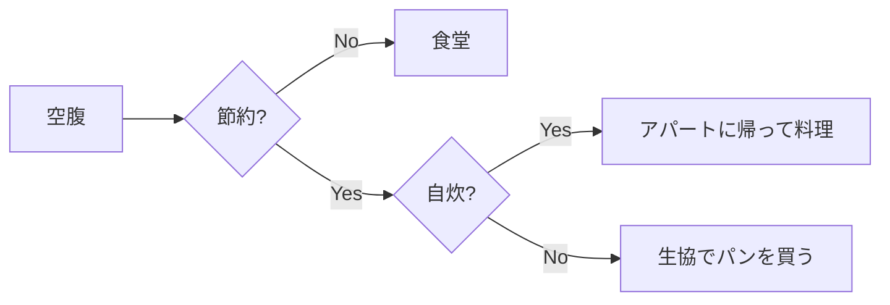
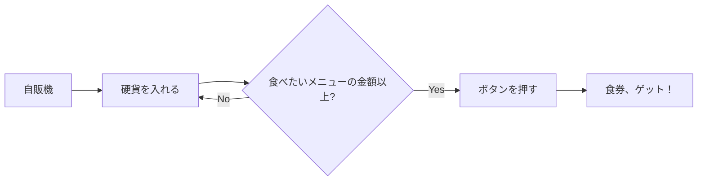
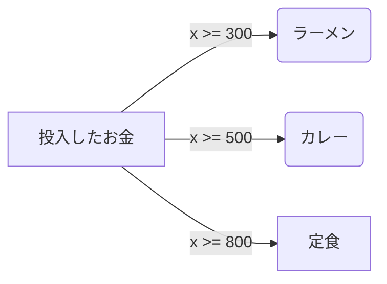
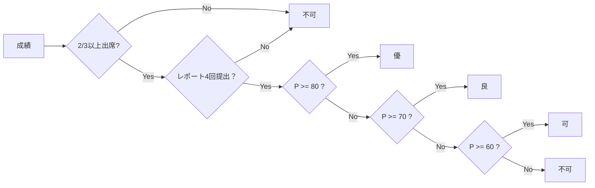
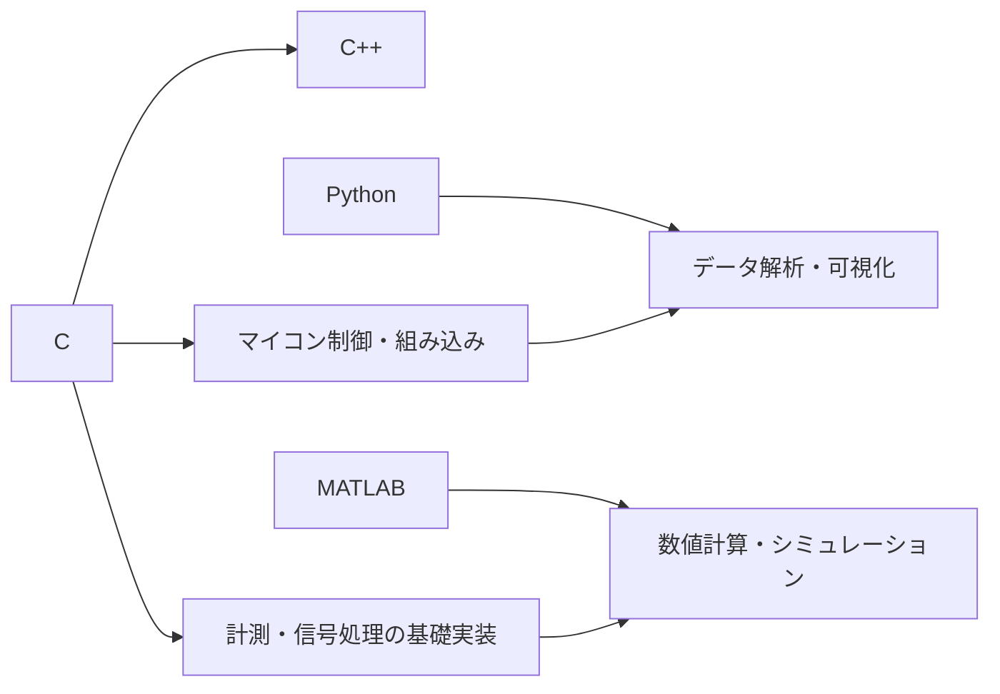
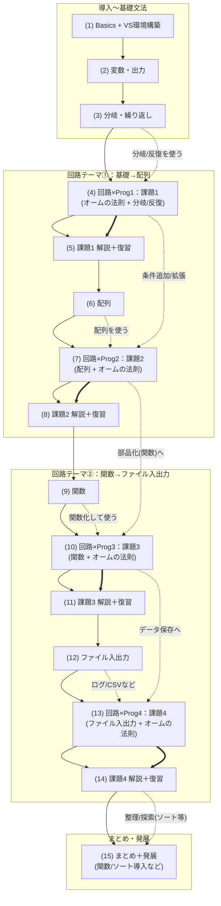
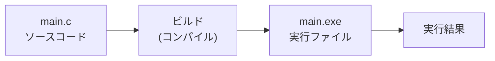

# 第1回：プログラムの基本

## 1. 導入
- まずは **読む／動かす／少し変える** から始める
- プログラムは「入力→処理→出力」を手順で書く
- 後半はサンプル実験 → VSCode で動かす

### 90分の流れ
- 前半（約45分）：スライド → 確認テスト（5問）
- 後半（約45分）：サンプル実験のコード確認 → VSCode で実行・改造

## 2. 今日のゴール（目標）
- Cプログラムの最小構成（include / main / return）を説明できます
- printfで文字を表示し、改行の意味を理解する
- サンプルコードを実行し、少し修正して再実行できます

---

:::set layout=1col side=right w=40 gap=16 fit=contain opacity=1

## プログラムとは何か（IPO）

- Input（入力）→ Process（処理）→ Output（出力）


- 電気回路の計算も同じ（与えられた値 → 計算 → 結果）
> **ポイント：** まずは Output（表示）から慣れる


---

## 身近な処理の流れの例（1）

- お腹が空く → 食堂へ行く → 食券を買う → 食べる
- お腹が空く → 節約したい → 生協でパンを買う → 食べる
- お腹が空く → 節約したい → アパートに帰って自炊する




---

## 身近な処理の流れの例（2）
- 自動販売機
- お金（小銭）を入れる → メニューの価格以上になるまで繰り返す → ボタンを押す






---
## 成績評価をフローチャートで示すと…



---
## 電気電子の学生がよく出会う言語

- ここでは、**今後の学習や実験で出会いやすい言語**に絞って見ます
- 初回では「全部覚える」必要はなく、**C言語がどこで役立つか**が分かれば十分です



### C
- ハードウェアに近い処理が得意
- マイコン、計測、制御、組み込みでよく使う
- **「回路や装置を実際に動かす側」** に強い

### C++
- C言語を拡張した言語
- Cの資産を活かしつつ、大きめのソフトウェアも作りやすい
- 研究室や開発現場で C と C++ が混在することも多い

### Python
- 書きやすく、データ解析やグラフ表示が得意
- 実験データの整理、CSV処理、可視化、機械学習でよく使う
- **「測った後に解析する側」** に強い

### MATLAB
- 行列計算、制御、信号処理、数値シミュレーションに強い
- 数式に近い形で試しやすく、理論確認との相性が良い
- **「式やモデルを素早く試す側」** に強い

> **ポイント:** この授業でC言語を学ぶのは、装置や回路に近いところを自分で扱えるようになるためです。その上で、解析や可視化では Python や MATLAB と組み合わせると強いです

---

## C言語の用途（電気電子工学の学生向け）

- ここでは、**この授業とつながりが強い代表例**に絞って見ます
- 初回では詳細を覚える必要はありません。**「C言語はこういう場面で役立つ」** とつかめれば十分です

### 1. 計測・データ収集
- センサや回路から値を読み取り、結果を表示したり保存したりする処理
- 実験データを整形して、あとで Python や MATLAB で解析しやすくする前処理
- この授業でも、**配列** や **ファイル入出力** を使って「読み取る・記録する」流れにつながります

> 例：電圧や抵抗のデータを読み取る → 計算する → 結果を保存する

### 2. 制御・組み込み
- LED、モータ、センサなど、**実際の装置を動かす側** のプログラム
- 入力に応じて出力を変える、一定周期で処理する、といった考え方が重要
- 将来、マイコンや実験装置を扱うときの土台になります

> 例：センサの値を読んで、条件に応じて LED やモータを制御する

### 3. 数値計算・シミュレーション
- オームの法則のような回路計算を、プログラムで繰り返し処理できます
- 条件を変えながら結果を比べると、式だけでは見えにくい振る舞いを確かめやすい
- 本編では回路計算やデータ処理を扱い、**第15+回の発展** ではシミュレーションにもつながります

> 例：抵抗値を変えながら電流を計算する、回路の応答を時間ごとに追う

### 4. PCでのデータ処理
- PC 上で大量のデータを整理したり、ファイルに保存したりする用途でも C は役立ちます
- 実験結果を記録する、読み直す、集計するといった処理は研究でもよく使います
- この授業の **ファイル入出力** の回は、その入口です

### C言語を学ぶメリット
- **回路とソフトをつなげて考えられる** ようになる
- **計算を自動化して確かめる力** が身につく
- **測る・記録する・処理する** という実験の基本に強くなる

---

## 本編15回の地図

- この図は **第1回〜第15回の本編** を表しています
- **第0回** は環境構築、**準備回** は授業運用の案内です
- **第15+回** は本編の後に扱う **応用編・発展内容** です



---
:::set layout=2col side=right w=40 gap=16 fit=contain opacity=1

## C言語プログラムの最小構成

- `#include <stdio.h>` ：printfを使う準備
- `int main(void)` ：ここから実行が始まる
- `return 0;` ：正常終了

```c
#include <stdio.h>
int main(void){
  printf("Hello, world!\n");
  return 0;
}
```

---

:::set layout=2col side=right w=40 gap=16 fit=contain opacity=1

## printf と改行（\n）

- 文字列を表示する： `printf("...");`
- `\n` は改行：出力が見やすくなる
- 出力結果が想定と一致するかを確認します

> **ポイント：** //なんとか は、コメント文（//以降の1行は、プログラムの動作には影響しない）

```c
#include <stdio.h>
int main(void){
  printf("Hello, world!\n"); //キーボード（OSの設定）によっては、¥n になる
  return 0;
}
```

---

:::set layout=2col side=right w=40 gap=16 fit=contain opacity=1

## よくあるつまずき

- セミコロン `;` の付け忘れ
- 波かっこ `{}` の対応
- 全角文字（記号）を混ぜない

```c
#include <stdio.h>
int main(void){
  printf("Hello, world!\n") // ; がない
  return 0;
                  //  } がない
```

:::set layout=1col side=right w=40 gap=16 fit=contain opacity=1

## インデント
- ブロックごとに行の頭を揃えることで見落としを防ぐ


---

:::set layout=2col side=right w=40 gap=16 fit=contain opacity=1

## ソースコードと実行ファイル

- `main.c` のような **.c ファイル** は、C言語で書いたソースコード
- ソースコードは、そのままでは実行できない
- **ビルド（コンパイル）** すると、実行できるファイルが作られる
- Windows では、実行ファイルは **.exe** になることが多い

> **ポイント:** `.c` は「書くファイル」、`.exe` は「動かすファイル」と考えると分かりやすい



---

:::set layout=2col side=right w=40 gap=16 fit=contain opacity=1

### まとめ

- Cは **mainから始まる**
- printfで出力できます
- まずは **動く最小例** を理解し、少しずつ増やす
- 次回：変数と計算（int / double / printfの書式）

```c
#include <stdio.h>
int main(void){
  printf("Hello, world!\n");
  return 0;
}
```

---

:::set layout=2col side=right w=40 gap=16 fit=contain opacity=1

## 後半：サンプル実験の解説

- 「サンプル実験」タブのコードを見ながら、**読むポイント**を確認します
- 基本は **読む → 動かす → 少し変える** です
- 入力値やファイル内容を変えて**挙動を観察**です

---

:::set layout=2col side=right w=40 gap=16 fit=contain opacity=1

### サンプル1：Hello, world（表示の流れ）

- `#include <stdio.h>`：printfを使う準備
- `main`：実行の入口
- `printf("...\n")`：文字列＋改行を出力
- **改造例**：表示する文字を変える／`\n` を外すと何が起きるか確認

---

:::set layout=2col side=right w=40 gap=16 fit=contain opacity=1

### サンプル2：整数の計算と出力（printf）

- `int a, b`：整数変数
- `a+b` をそのまま `printf` に渡して表示している
- `%d`：int の表示（10進）
- **改造例**：`a` や `b` を変えて結果が変わることを確認

---

:::set layout=2col side=right w=40 gap=16 fit=contain opacity=1

### サンプル3：コンパイル → 実行のイメージ（擬似）

- ツール内では「コマンドの流れ」を擬似的に確認するサンプル
- 実機（VSCode）では **ビルド → 実行** の手順になる

---

:::set layout=2col side=right w=40 gap=16 fit=contain opacity=1

### VSCode 実習の進め方

1. 授業資料ツールの **サンプル実験** を実行して、出力・変数表示を確認
2. そのまま **VSCode** で同等のコードを作成して実行
3. 値や条件を変えて挙動を観察（例：定数／配列の中身／ループ回数）
