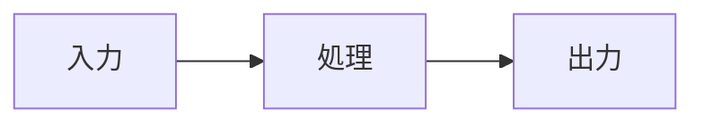
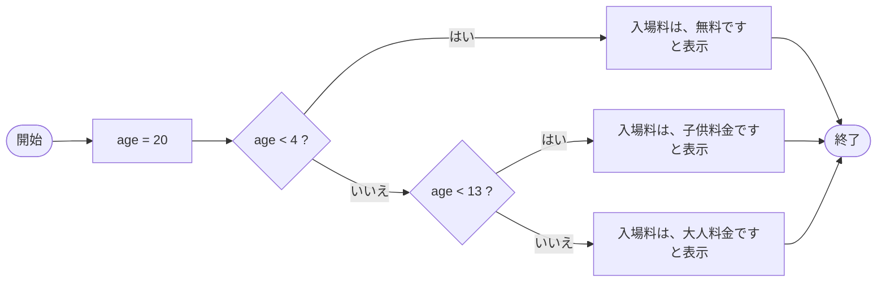
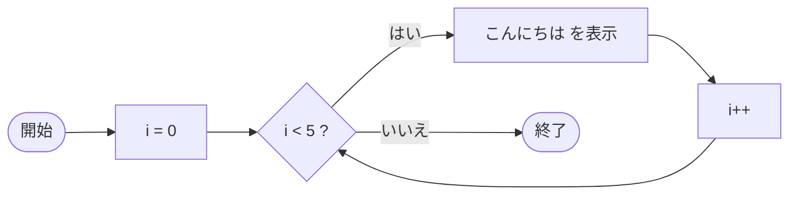

:::set layout=2col side=right w=40 gap=16 fit=contain opacity=1

# 第3回：条件分岐と繰り返し（if, for, while）

## 1. 導入
- 条件で処理を変える（if）
- 同じ処理を繰り返す（for, while）
- 後半：サンプルを動かして、条件や回数を変えて確認

### 90分の流れ
- 前半（約45分）：スライド → 確認テスト（5問）
- 後半（約45分）：サンプル実験のコード確認 → VSCode で実行・改造

## 2. 今日のゴール（目標）
- if/else の基本形と条件式を書ける
- for, while で繰り返し回数や停止条件を制御できる
- 代表的なミス（= と ==、無限ループ）を避けられる

---

:::set layout=1col side=right w=40 gap=16 fit=contain opacity=1

## 条件分岐、繰り返しがなぜ必要なのか？

- Input（入力）→ Process（処理）→ Output（出力）



### 条件分岐がなかったら
- 条件が変わる度に、値を書き換えてプログラムを再実行する必要がある

### 繰り返しがなかったら
- 100回の処理を行うために、プログラムを100回実行する必要がある

### 繰り返しがあれば
- プログラムの中で100回の繰り返し処理を行うようにすると？？
  ⇨ プログラムは、1回の実行で済む

> **ポイント:** 条件分岐、繰り返しをうまく使ってプログラムをわかりやすく記述する


---

:::set layout=1col side=right w=40 gap=16 fit=contain opacity=1

## プログラムの基本的な流れ（３種）

### 基本
- 開始から終了まで、一方通行
- 結果は、常に同じ（1回のみ）

### 条件分岐
- プログラムの途中に条件による分岐がある
- 結果は、条件によって変わる

### 繰り返し
- プログラムの途中である処理を繰り返す部分がある
- 結果は、指定した回数の分だけ表示される
- 繰り返す度に処理に使う値が変わると、当然、結果も変わる

---

:::set layout=1col side=right w=40 gap=16 fit=contain opacity=1

## 条件分岐

### 条件分岐（if）


### 条件分岐2（if...else...）


---

:::set layout=1col side=right w=40 gap=16 fit=contain opacity=1

## 条件の判定

### 比較演算子


### 論理演算子


---

:::set layout=1col side=right w=40 gap=16 fit=contain opacity=1

### if / else の基本

- 条件が真なら `if` 側、偽なら `else` 側の処理を実行する
- 比較：`==`（等しい）、`!=`（等しくない）
- 範囲判定：`&&`（かつ）、`||`（または）



```c
#include <stdio.h>
int main(void){
  int age = 20;
  
  if(age < 4){
    printf("入場料は、無料です\n");
  }else if(age < 13){
    printf("入場料は、子供料金です\n");
  }else{
    printf("入場料は、大人料金です\n");
  }
  
  return 0;
}
```

---

:::set layout=1col side=right w=40 gap=16 fit=contain opacity=1

## 繰り返し（for, while）

- ある条件を満たす間、繰り返し同じ処理を行う
- `i` を １ずつ増やしていき、5 より 小さい間は繰り返し処理を行う
- `for`, `while` の２種類をよく使う


---

:::set layout=1col side=right w=40 gap=16 fit=contain opacity=1

### for の基本（回数が決まる）

- `for(初期化; 条件; 更新)`
- 合計・平均・表の出力に頻出
- iの開始と終わり（<=, <）を意識する


```c
#include <stdio.h>
int main(void){

  for(int i=0; i<5; i++){  // for文の定義のなかで i++
    printf("こんにちは\n");
  }

  return 0;
}
```

---

:::set layout=1col side=right w=40 gap=16 fit=contain opacity=1

### while の基本（条件で続ける）

- `while(継続条件){ 処理 }`
- 回数が決まらない繰り返しに使う
- 継続条件の更新を書き忘れると**無限ループ**
- デバッグは「今の値」を表示すると早い

> **ポイント:** デバッグ（debug）とはプログラムの実行状態を出力し動作確認を行い修正すること



```c
#include <stdio.h>
int main(void){

  int i = 0;
  while(i < 5){
    printf("こんにちは\n");
    i++;   // while文の関数のなかで i++
  }

  return 0;
}
```

---

:::set layout=2col side=right w=40 gap=16 fit=contain opacity=1

## 参考:真（true）と偽（false）

条件分岐（`if`）や繰り返し（`while`）では、条件式が

- **成立（真 / true）** → 処理を実行する
- **不成立（偽 / false）** → 処理を実行しない（`else` 側に進む）

というルールで動きます。

### C言語での「真・偽」の考え方
C言語では、条件式の結果を「数」で扱います。

- **0 が `偽（0 == false）`**
- **0 以外が `真（0 != true）`**

たとえば、次の条件は「`a` が 0 ではない」なら成立します。

```c
if (a) {
  printf("a は 0 ではない（真）\n");
} else {
  printf("a は 0（偽）\n");
}
```

### 比較演算子の結果も「真・偽」
比較（`==`, `!=`, `<`, `<=`, `>`, `>=`）の結果も真・偽になります。

```c
int x = 3;

if (x > 0) {
  printf("x は正（真）\n");
} else {
  printf("x は 0 以下（偽）\n");
}
```

### よくある注意（= と == の違い）
- `=` は **代入**
- `==` は **等しいかどうかの比較**

```c
// 正しい（比較）
if (x == 0) { ... }

// 間違えやすい（代入になってしまう）
if (x = 0) { ... }
```

（※ `if (x = 0)` は x に 0 を代入してしまい、条件は常に偽になってしまいます）

---

:::set layout=2col side=right w=40 gap=16 fit=contain opacity=1

### まとめ

- `if`：条件で分ける
- `for`, `while`：繰り返す
- 比較は `==`、代入は `=`（混同注意）
- 次回：回路×演習（課題1）

### `while`, `if` の組み合わせの例

```c
#include <stdio.h>
int main(void){

  int i = 0;
  while(i < 100){
    if(i % 2 == 0){         // もしも、i が２の倍数＝偶数なら
      printf("こんにちは\n");
    }
    
    i++;                   // while文の関数のなかで i++
  }
  
  return 0;
}
```

---

:::set layout=2col side=right w=40 gap=16 fit=contain opacity=1

## 後半：サンプル実験の解説

- 「サンプル実験」タブのコードを見ながら、**読むポイント**を確認します
- 基本は **読む → 動かす → 少し変える** です
- 入力値やファイル内容を変えて**挙動を観察**します

---

:::set layout=2col side=right w=40 gap=16 fit=contain opacity=1

### サンプル1：if/else（偶数・奇数）

- `%`（剰余）で偶数判定：`n%2==0`
- `if/else` で分岐する
- **改造例**：`n` を偶数に変えて出力が切り替わるか確認

---

:::set layout=2col side=right w=40 gap=16 fit=contain opacity=1

### サンプル2：for（1〜5の合計）

- `for` の3要素：初期化／条件／更新
- `sum += i` で1〜5を加算
- **改造例**：`<=5` を `<=10` にして合計を確認

---

:::set layout=2col side=right w=40 gap=16 fit=contain opacity=1

### サンプル3：while（カウントダウン）

- `while(条件)`：条件が真の間くり返す
- ループ内で `n--` して終了に近づける（無限ループ防止）
- **改造例**：開始値 `n` を変える／`n--` を消すと何が起きるか（注意）

---

:::set layout=2col side=right w=40 gap=16 fit=contain opacity=1

### VSCode 実習の進め方

1. 授業資料ツールの **サンプル実験** を実行して、出力・変数表示を確認します
2. そのまま **VSCode** で同等のコードを作成して実行します
3. 値や条件を変えて挙動を観察します（例：定数／配列の中身／ループ回数）
