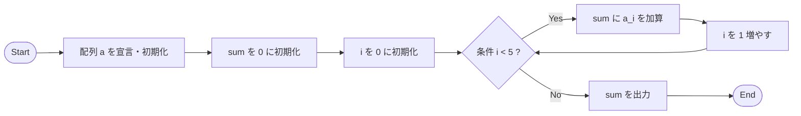
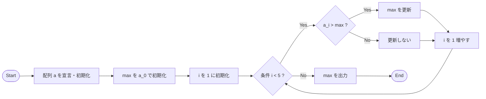
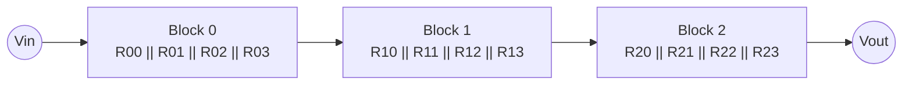
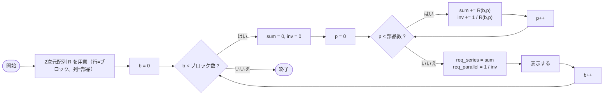

:::set layout=2col side=right w=40 gap=16 fit=contain opacity=1

# 第6回：配列（一次元配列）

## 1. 導入
- 同じ種類の値を「まとまり」で扱う＝配列
- 測定データや抵抗値の一覧を扱う基礎
- 後半：配列の合計・最大値のサンプルを動かす

### 90分の流れ
- 前半（約45分）：スライド → 確認テスト（5問）
- 後半（約45分）：サンプル実験のコード確認 → VSCode で実行・改造

## 2. 今日のゴール（目標）
- 配列の宣言と要素アクセス（a[0]〜）ができる
- forと組み合わせて合計・平均・最大値を求められる
- 範囲外アクセスを避ける（サイズと添字）

---

:::set layout=1col side=right w=40 gap=16 fit=contain opacity=1

## 配列

### 同じ型の変数をまとめて準備（定義）できる

> **ポイント:** 個別に定義した場合：数が増えると大変！

```c
#include <stdio.h>
int main(void){

  int a0 = 2, a1 = 4, a2 = 6, a3 = 8, a4 = 10;

  return 0;
}
```

> **ポイント:** 配列で定義した場合：まとめて定義できるので扱いやすい！

```c
#include <stdio.h>
int main(void){

  int a[5] = {2, 4, 6, 8, 10}; //a[0], a[1], a[2], a[3], a[4] :5個

  return 0;
}
```


---

:::set layout=1col side=right w=40 gap=16 fit=contain opacity=1

### 配列の宣言と添字（index）

- 例：`int a[5];` は要素が5個
- 添字は0始まり：`a[0]`〜`a[4]`
- サイズを超えるとバグの原因（未定義動作）

```c
#include <stdio.h>
int main(void){
  int a[5] = {2,4,6,8,10};
  printf("%d\n", a[0]);
  printf("%d\n", a[4]);
  return 0;
}
```


---

:::set layout=2col side=right w=40 gap=16 fit=contain opacity=1

### 合計（forとセット）

- 合計：`sum` に足し込む
- データ処理の基本形



```c
#include <stdio.h>
int main(void){
  int a[5] = {2,4,6,8,10};
  int sum = 0;
  for(int i=0;i<5;i++){
    sum += a[i];
  }
  printf("%d\n", sum);
  return 0;
}
```

---

:::set layout=2col side=right w=40 gap=16 fit=contain opacity=1

### 最大値（比較しながら更新）

- 最初の要素を仮の最大にする
- 順に比べて更新していく

> **ポイント:** 同じ考え方で最小値も作れる



```c
#include <stdio.h>
int main(void){
  int a[5] = {2,14,6,8,10};
  int max = a[0];
  for(int i=1;i<5;i++){
    if(a[i] > max) max = a[i];
  }
  printf("%d\n", max);
  return 0;
}
```

---

:::set layout=2col side=right w=40 gap=16 fit=contain opacity=1

## まとめ

- 配列は「同種データのまとまり」：a[0] から始まる
- forと組み合わせると合計・最大値などが書ける
- 次回：回路×配列（課題2）

> **ポイント:** サンプル実験のプログラムで動作を確認します
```C
#include <stdio.h>
int main(void){
  int a[5]={1,2,3,4,5};
  int sum=0;
  for(int i=0;i<5;i++) {
    sum+=a[i];            // sum に a[i] の中身を順番に足していく
  }
  printf("%d\n", sum);
  return 0;
}
````

---

:::set layout=1col side=right w=40 gap=16 fit=contain opacity=1

## 参考：２次元配列（１）

### 数学でいうベクトル（線形代数）のような形で定義できる


---

:::set layout=1col side=right w=40 gap=16 fit=contain opacity=1

## 参考：２次元配列（２）

### よくあるのは、forの二重ループ:forの中にforを書く
- 2次元配列 = 部品表（行＝ブロック、列＝部品）
- R[b] を渡すと「その行が1次元配列として扱える」
- 直列は足し算／並列は逆数の和で求められる





```c
#include <stdio.h>

#define BLOCKS 3
#define PARTS  4

int main(void) {
    double R[BLOCKS][PARTS] = {
        {100, 220, 330, 470},
        {1000, 1000, 2000, 4000},
        {10, 20, 30, 40}
    };

    for (int b = 0; b < BLOCKS; b++) {
        double sum = 0.0;   // 直列合成（足し算）
        double inv = 0.0;   // 並列合成（逆数の和）

        for (int p = 0; p < PARTS; p++) {
            sum += R[b][p];
            inv += 1.0 / R[b][p];
        }

        double req_series   = sum;
        double req_parallel = 1.0 / inv;

        printf("Block %d: series=%g ohm, parallel=%g ohm\n",
               b, req_series, req_parallel);
    }

    return 0;
}
```

---
:::set layout=2col side=right w=40 gap=16 fit=contain opacity=1

## 後半：サンプル実験の解説

- 「サンプル実験」タブのコードを見ながら、**読むポイント**を確認します
- 基本は **読む → 動かす → 少し変える** です
- 入力値やファイル内容を変えて**挙動を観察**します

---

:::set layout=2col side=right w=40 gap=16 fit=contain opacity=1

### サンプル1：配列の合計

- 配列 `a[]`：同じ型の値を並べて扱う
- `for` で `a[i]` を順番に足して `sum` を作る
- **注意**：添字は **0から**
- **改造例**：配列の要素を変えて合計が変わるか確認

---

:::set layout=2col side=right w=40 gap=16 fit=contain opacity=1

### サンプル2：最大値を探す

- `max` を最初の要素で初期化しておくのが基本
- `if(a[i] > max)` で最大値更新
- **改造例**：要素を並べ替えても最大値が取れるか確認

---

:::set layout=2col side=right w=40 gap=16 fit=contain opacity=1

### サンプル3：配列とprintf（一覧表示）

- `for` で配列を1行ずつ表示するパターン
- デバッグでは **i の変化** と **a[i]** を追うと理解しやすい
- **改造例**：表示形式を `i=` 付きにする（例：`printf("i=%d a=%d\n", i, a[i]);`）

---

:::set layout=2col side=right w=40 gap=16 fit=contain opacity=1

### VSCode 実習の進め方

1. 授業資料ツールの **サンプル実験** を実行して、出力・変数表示を確認します
2. そのまま **VSCode** で同等のコードを作成して実行します
3. 値や条件を変えて挙動を観察します（例：定数／配列の中身／ループ回数）
