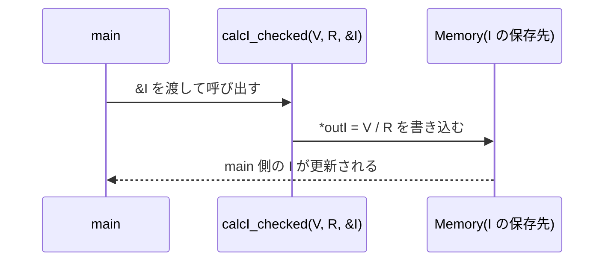
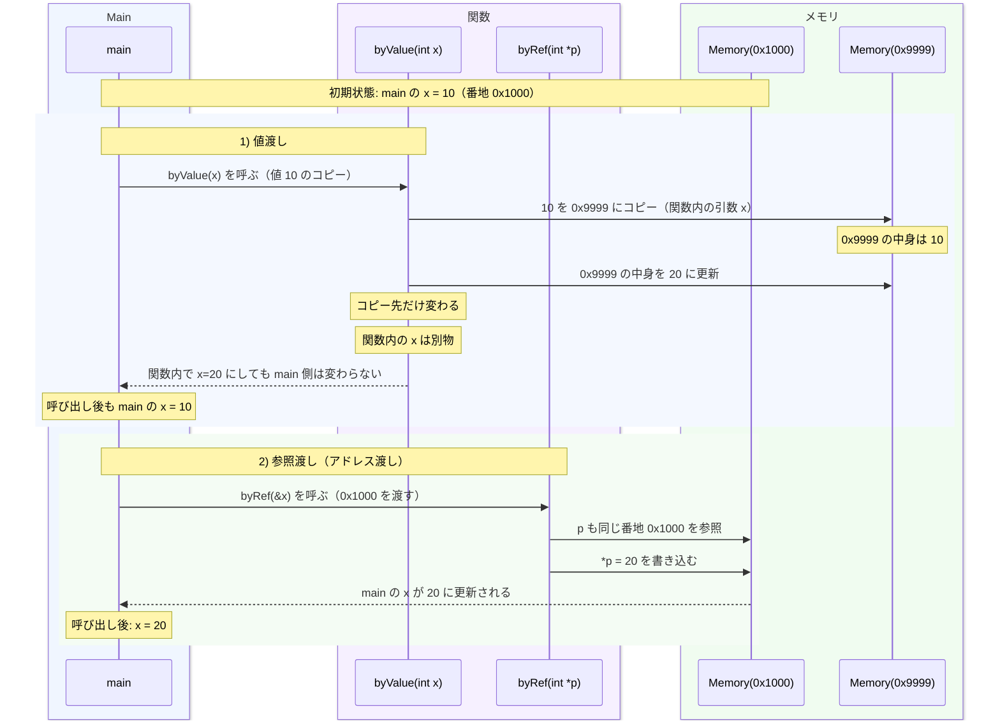

:::set layout=1col side=right w=40 gap=16 fit=contain opacity=1

# 第11回：電気回路とプログラミング3（演習課題3）：解説

## 課題
電流計算を関数に分け、mainから呼び出す形でプログラムを完成させてください。  
この回は **関数（引数・戻り値）** と **配列＋for** がポイントです（**scanfは使いません**）。

## 仕様（提出物）
- 関数 `calcI(V, R)` を作り、`I = V / R` を返す
- 入力は `scanf` を使わず、`V_list` / `R_list` の **配列**で5ケース処理する
- `R <= 0` は `"R error"` を表示してスキップ
- `I` を小数3桁で表示
- 有効データの `avg` / `max` / `min` を表示（有効0なら `NA`）


---

:::set layout=2col side=right w=40 gap=16 fit=contain opacity=1

## 未完成コード（課題）

```c
#include <stdio.h>

// 計算専用
double calcI(double V, double R){
  return V / R;
}

// 入力チェック込み（成功:1 / 失敗:0）
int calcI_checked(double V, double R, double *outI){
  if(R <= 0) return 0;
  *outI = calcI(V, R);
  return 1;
}

// TODO1-1: 新しいmaxを返す
double maxValue(double a, double b){
  if(???) return a;  // もし、a が b よりも大きければ、a を返す
  return b;          // そうでない場合は、b を返す
}

// TODO1-2: 新しいminを返す
double minValue(double a, double b){
  if(???) return a;  // もし、a が b よりも小さければ、a を返す
  return b;          // そうでない場合は、b を返す
}

int main(void){
  double V_list[] = {5.0, 5.0, 5.0, 12.0, 9.0};  // 電圧リスト
  double R_list[] = {5.0, 10.0, 0.0, 6.0, 3.0};  // 抵抗リスト
  int N = (int)(sizeof(V_list) / sizeof(V_list[0]));

  double sumI = 0.0;
  int validCount = 0;
  double maxI = 0.0;
  double minI = 0.0;

  for(int k = 0; k < N; k++){
    double V = ???;        // TODO2-1: 電圧リストのk番目
    double R = ???;        // TODO2-2: 抵抗リストのk番目
    double I;

    printf("case %d: V=%.1f R=%.1f -> ", k + 1, V, R);

    if(!calcI_checked(V, R, &I)){
      printf("R error\n");
      continue;
    }

    printf("I=%.3f\n", I);

    sumI += I;
    if(validCount == 0){
      maxI = I;
      minI = I;
    }else{
      maxI = ???(maxI, I);  // TODO3-1: 電流の最大値を取得する関数を呼ぶ
      minI = ???(minI, I);  // TODO3-2: 電流の最小値を取得する関数を呼ぶ
    }
    validCount++;
  }

  if(validCount > 0){
    printf("avg=%.3f\n", sumI / validCount);
    printf("max=%.3f\n", maxI);
    printf("min=%.3f\n", minI);
  }else{
    printf("avg=NA\n");
    printf("max=NA\n");
    printf("min=NA\n");
  }

  return 0;
}
```

---

:::set layout=2col side=right w=40 gap=16 fit=contain opacity=1

## 解答

```c
#include <stdio.h>

// 計算専用
double calcI(double V, double R){
  return V / R;
}

// 入力チェック込み（成功:1 / 失敗:0）
int calcI_checked(double V, double R, double *outI){
  if(R <= 0) return 0;
  *outI = calcI(V, R);
  return 1;
}

// TODO1-1: 新しいmaxを返す
double maxValue(double a, double b){
  if(a > b) return a;  // もし、a が b よりも大きければ、a を返す
  return b;            // そうでない場合は、 b を返す
}

// TODO1-2: 新しいminを返す
double minValue(double a, double b){
  if(a < b) return a;  // もし、a が b よりも小さければ、a を返す
  return b;            // そうでない場合は、 b を返す
}

int main(void){
  double V_list[] = {5.0, 5.0, 5.0, 12.0, 9.0};  // 電圧リスト
  double R_list[] = {5.0, 10.0, 0.0, 6.0, 3.0};  // 抵抗リスト
  int N = (int)(sizeof(V_list) / sizeof(V_list[0]));

  double sumI = 0.0;
  int validCount = 0;
  double maxI = 0.0;
  double minI = 0.0;

  for(int k = 0; k < N; k++){
    double V = V_list[k];  // TODO2-1: 電圧リストのk番目
    double R = R_list[k];  // TODO2-2: 抵抗リストのk番目
    double I;

    printf("case %d: V=%.1f R=%.1f -> ", k + 1, V, R);

    if(!calcI_checked(V, R, &I)){
      printf("R error\n");
      continue;
    }

    printf("I=%.3f\n", I);

    sumI += I;
    if(validCount == 0){
      maxI = I;
      minI = I;
    }else{
      maxI = maxValue(maxI, I);  // TODO3-1: 電流の最大値を取得する関数を呼ぶ
      minI = minValue(minI, I);  // TODO3-2: 電流の最小値を取得する関数を呼ぶ
    }
    validCount++;
  }

  if(validCount > 0){
    printf("avg=%.3f\n", sumI / validCount);
    printf("max=%.3f\n", maxI);
    printf("min=%.3f\n", minI);
  }else{
    printf("avg=NA\n");
    printf("max=NA\n");
    printf("min=NA\n");
  }

  return 0;
}
```

---

:::set layout=2col side=right w=40 gap=16 fit=contain opacity=1

## 補足：ポインタ（この回で使う範囲）

- `double *outI`：計算結果を書き込む先（呼び出し元の変数）を受け取る
- `&I`：変数 `I` のアドレス（場所）を `calcI_checked` に渡す
- 課題3では「ポインタ演算」はせず、関数の引数として使うのが中心

| 観点 | メリット | デメリット |
|---|---|---|
| ポインタ利用 | 関数の外の変数を更新できる（`&I`→`*outI`） | 書き先を間違えるとバグになりやすい |
| メモリ効率 | 大きなデータをコピーせずに扱える | 学習初期は `*` と `&` の理解が必要 |



### `*` と `&` の最小確認

- `*`：ポインタ型を宣言するとき、または参照先にアクセスするときに使う
- `&`：変数のアドレス（場所）を取り出す

```c
double I = 0.0;
double *p = &I;

*p = 1.23;   // I の値が更新される
printf("I=%.2f\n", I);
```

### 次回（入出力）へのつながり

- キーボード入力 `scanf` でも、値を書き込む先として `&x` を渡す
- ファイル入力 `fscanf` でも、同様に `&V`, `&R` を渡す
- つまり「この回の `&I`」と「次回の `&x`, `&V`」は同じ考え方

```c
int x;
double V, R;

scanf("%d", &x);                 // キーボード入力
fscanf(fp, "%lf %lf", &V, &R);   // ファイル入力
```

---

:::set layout=2col side=right w=40 gap=16 fit=contain opacity=1

## 値渡しと参照渡し（この回の視点）

- この図は、`main` の変数 `x` に対して「値渡し」と「参照渡し（アドレス渡し）」を時系列で比較しています
- 値渡し：`byValue(x)` に「10 のコピー」を渡すため、関数内で `x=20` にしても `main` 側は変わりません
- 参照渡し（Cではアドレス渡し）：`byRef(&x)` に `0x1000` を渡すため、`*p=20` で `main` 側の `x` が更新されます
- シーケンス図の見方：`Main -> ByValue/ByRef` は関数呼び出し、`ByRef -> Memory` は同じ番地への書き込みを表します



```c
void byValue(int x){ x = 20; }          // 呼び出し元は変わらない
void byRef(int *p){ *p = 20; }          // 呼び出し元が変わる
```
