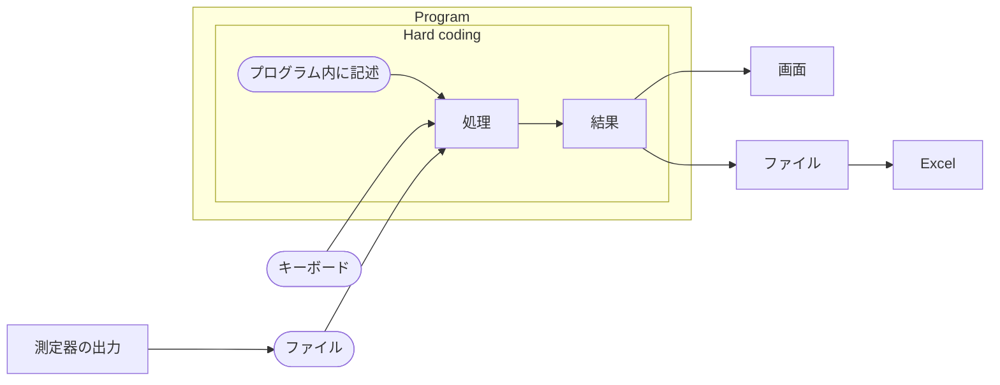
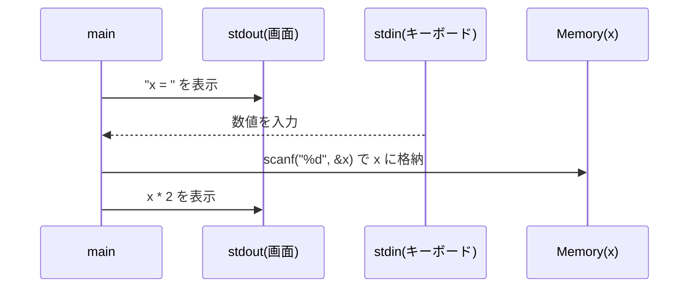
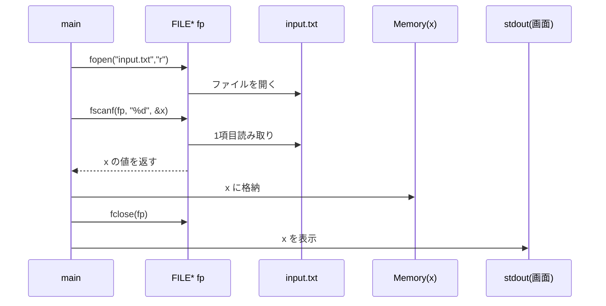
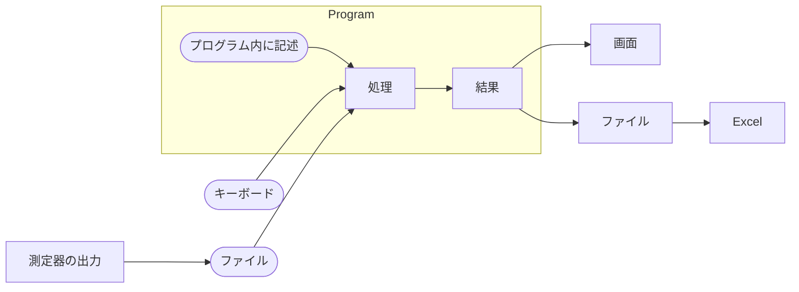
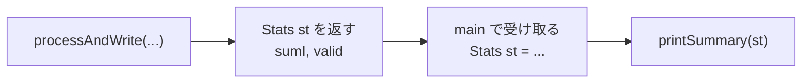

:::set layout=2col side=right w=40 gap=16 fit=contain opacity=1

# 第12回：入出力（キーボード入力とファイル入出力）

## 1. 導入
- 「入力」：外部から値を受け取る（キーボード／ファイルなど）
- 「出力」：結果を外部へ出す（画面表示／ファイル保存など）
- 本日は **標準入出力（scanf/printf）** と **ファイル入出力（fscanf/fprintf）** を扱う

### 90分の流れ
- 前半（約45分）：スライド → 確認テスト（5問）
- 後半（約45分）：サンプル実験（I/Oの動作確認）→ VSCode で実行・改造

## 2. 今日のゴール（目標）
- プログラムにおける入力・出力の役割を説明できる
- `scanf` / `printf` で「読む・表示する」ができる
- `fscanf` / `fprintf` の基本形（開く→読む/書く→閉じる）を説明できる

---

:::set layout=2col side=right w=40 gap=16 fit=contain opacity=1

### プログラムにおける「入力」「出力」

- **入力（`Input`）**：外部からプログラムに与える値  
  例）キーボード、ファイル、センサ、ネットワーク など

- **出力（`Output`）**：プログラムが外部へ出す結果  
  例）画面表示、ファイル保存、LED点灯、モータ制御 など

> 入出力があると「外の世界」とつながり、同じプログラムでも入力が変われば結果が変わる


---

:::set layout=2col side=right w=40 gap=16 fit=contain opacity=1

### 標準入出力について

- **標準入力（`stdin`）**：基本はキーボードからの入力
- **標準出力（`stdout`）**：基本はコンソール（画面）への出力

- 代表的な関数  
  - 入力：`scanf`
  - 出力：`printf`

---

:::set layout=2col side=right w=40 gap=16 fit=contain opacity=1

### 標準入出力：画面出力（printf）

- `printf("...")` で文字や数値を表示
- よく使う書式
  - `%d`：int
  - `%lf`：double（scanf用）
  - `%.2f`：double（表示用：小数2桁）
  - `\n`：改行

例：
```c
double v = 3.14159;
printf("v = %.2f\n", v);   // v = 3.14
```

---

:::set layout=2col side=right w=40 gap=16 fit=contain opacity=1

### 標準入出力：ハードコーディング

値をプログラム内に直接書く（入力が固定）：
- いつ実行しても結果は同じ
- 簡単だが、入力を変えるにはコード修正が必要



```c
#include <stdio.h>

int main(void){
  int a = 12;
  int b = 4;
  int sum = a + b;
  printf("sum = %d\n", sum);
  return 0;
}
```

---

:::set layout=2col side=right w=40 gap=16 fit=contain opacity=1

### 標準入出力：キーボード入力（scanf）

値をキーボードから入力（入力が可変）：
- `%d`：int（整数）として読む
- `&x`：xそのものではなく、**xに値を書き込む場所**を渡す
- 今は「scanfは、値を入れたい変数の場所を受け取る」と考えればOK



```c
#include <stdio.h>

int main(void){
  int x;
  printf("x = ");
  scanf("%d", &x);
  printf("x * 2 = %d\n", x * 2);
  return 0;
}
```

---

:::set layout=2col side=right w=40 gap=16 fit=contain opacity=1

### scanf の戻り値で入力成功を確認

- `scanf` は **読み取れた項目数** を返す

```c
#include <stdio.h>

int main(void){
  int x;
  printf("x = ");
  if (scanf("%d", &x) != 1){
    printf("入力が不正です\n");
    return 0;
  }
  printf("x = %d\n", x);
  return 0;
}
```

---

### ファイル入出力について

- **ファイル入力**：ファイルの内容を読み取って処理する（実験データ・ログ）
- **ファイル出力**：結果をファイルに保存する（提出・再利用・解析）


---

:::set layout=2col side=right w=40 gap=16 fit=contain opacity=1

### ファイル入力（fscanf）の基本形

- まずファイルを開く：`fopen`
- 読む：`fscanf`
- 閉じる：`fclose`



```c
#include <stdio.h>

int main(void){
  FILE *fp = fopen("input.txt", "r");
  if (fp == NULL){
    printf("ファイルを開けません\n");
    return 0;
  }

  int x;
  fscanf(fp, "%d", &x);
  fclose(fp);

  printf("x = %d\n", x);
  return 0;
}
```

---

:::set layout=2col side=right w=40 gap=16 fit=contain opacity=1

### fscanf の戻り値（読み取り成功の確認）

- `fscanf` も `scanf` と同じく **読み取れた項目数** を返す

```c
int x;
if (fscanf(fp, "%d", &x) != 1){
  printf("読み取りに失敗しました\n");
}
```

---

:::set layout=2col side=right w=40 gap=16 fit=contain opacity=1

### ファイル出力（fprintf）の基本形

- 開くモード `"w"`：書き込み（新規作成／上書き）
- 書く：`fprintf`
- 閉じる：`fclose`

```c
#include <stdio.h>

int main(void){
  FILE *fp = fopen("output.txt", "w");
  if (fp == NULL){
    printf("ファイルを開けません\n");
    return 0;
  }

  int a = 12, b = 4;
  fprintf(fp, "a=%d b=%d sum=%d\n", a, b, a+b);

  fclose(fp);
  printf("output.txt に保存しました\n");
  return 0;
}
```

---

:::set layout=2col side=right w=40 gap=16 fit=contain opacity=1

### printf と fprintf の違い

- `printf`：出力先が 画面（stdout）
- `fprintf`：出力先が ファイル（FILE*）

```c
printf("x=%d\n", x);          // 画面へ
fprintf(fp, "x=%d\n", x);     // ファイルへ
```

---

:::set layout=2col side=right w=40 gap=16 fit=contain opacity=1

### まとめ

- 入出力は「外の世界」とつなぐ仕組み
- 標準入出力：`scanf`（入力）、`printf`（出力）
- ファイル入出力：`fscanf`（入力）、`fprintf`（出力）
- どちらも **戻り値**で成功判定できる



---

:::set layout=2col side=right w=40 gap=16 fit=contain opacity=1

## 後半：サンプル実験の解説

- 「サンプル実験」タブのコードを見ながら、**読むポイント**を確認します
- 基本は **読む → 動かす → 少し変える** です
- 入力値やファイル内容を変えて**挙動を観察**します

---

:::set layout=2col side=right w=40 gap=16 fit=contain opacity=1

### サンプル1：scanf（キーボード入力）の最小例

- 1つの整数を入力して、そのまま表示する最小構成
- `scanf(...)` の**戻り値**で「読み取れた項目数」を判定（例：`!= 1` なら失敗）
- **改造例**：入力を2回読んで合計を出す／入力失敗時に再入力させる

---

:::set layout=2col side=right w=40 gap=16 fit=contain opacity=1

### サンプル2：scanfで2値入力→計算（V, R → I）

- `V` と `R` を入力し、オームの法則 `I = V / R` を計算
- `scanf(...) != 2` のときは入力失敗（項目数が足りない）
- `R <= 0` のチェックで **0除算・不正値** を避ける
- **改造例**：`R==0` のときはエラー表示して計算しない（ifで分岐）

---

:::set layout=2col side=right w=40 gap=16 fit=contain opacity=1

### サンプル3：ファイル入力（fscanf）の基本形

- `fopen` → `fscanf` → `fclose` の流れ（**開く→読む→閉じる**）
- `fscanf` の戻り値で「読み取れた項目数」を確認し、期待値と違えば読み取り失敗
- **改造例**：行数を増やす／入力ファイルの値を変えて結果が変わることを確認

---

:::set layout=2col side=right w=40 gap=16 fit=contain opacity=1

### サンプル4：ファイル出力（fprintf）の基本形

- `fopen("w")` → `fprintf` → `fclose` の流れ（**開く→書く→閉じる**）
- `printf` は画面、`fprintf` は **FILE\* で指定したファイル**へ出力
- **改造例**：出力する行を増やす／書式（小数点桁数など）を変える

---

:::set layout=2col side=right w=40 gap=16 fit=contain opacity=1

### VSCode 実習の進め方

1. LectureTool の **サンプル実験** を実行して、出力・変数表示を確認します
2. そのまま **VSCode** で同等のコードを作成して実行します
3. 値や条件を変えて挙動を観察します（例：入力値／ファイルの中身／チェック条件）

---

:::set layout=2col side=right w=40 gap=16 fit=contain opacity=1

## 補足：構造体 `Stats`（課題4につながる考え方）

- **構造体（struct）**は、関連する値を1つにまとめるための型です
- 課題4では、平均計算に必要な `sumI`（合計）と `valid`（有効件数）を `Stats` にまとめます
- `processAndWrite` が `Stats` を返すことで、main側は受け取って `printSummary(st)` を呼ぶだけになります
- 構造体のメンバーには `.` でアクセスします（例：`st.sumI`、`st.valid`）

```c
typedef struct {
  double sumI;  // 有効な電流値の合計
  int valid;    // 有効データ件数
} Stats;
```

```c
Stats st = {0.0, 0};
st.sumI += 1.2;  // . で sumI にアクセス
st.valid++;      // . で valid にアクセス
```



> 主題は I/O（開く→読む/書く→閉じる）です。  
> `Stats` は「集計結果をまとめて返す」ための整理方法として使います。
