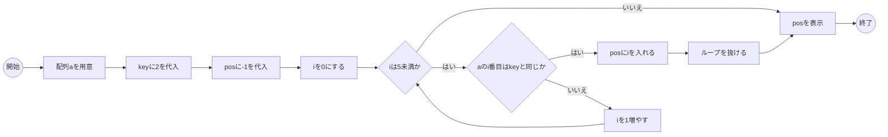
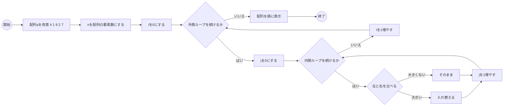
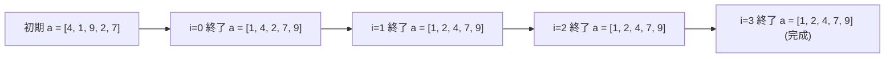
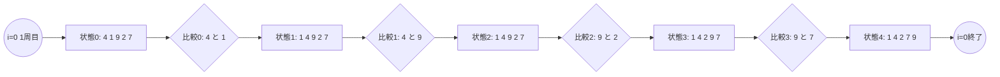

:::set layout=1col side=right w=40 gap=16 fit=contain opacity=1

# 第15回：総括と今後の学習（発展：探索・ソート）

## 1. 導入
- これまでの道具（配列・関数・ファイル）を整理する
- 発展として「探索」「ソート」を体験する
- 第12回で触れた **構造体** も復習し、次の第15+回（RLC：RK4）につなげる

### 90分の流れ
- 前半（約45分）：スライド → 確認テスト（5問）
- 後半（約45分）：サンプル実験のコード確認 → VSCode で実行・改造

## 2. 今日のゴール（目標）
- 探索（線形探索）の考え方を説明できる
- ソート（バブルソート）の動きを言葉で説明できる
- structで「関連する値」をまとめる考え方を復習できる

---

:::set layout=2col side=right w=40 gap=16 fit=contain opacity=1

### 探索：線形探索（Linear Search）

- 配列の中から目的の値を探す
- 上から順に見ていく（最もシンプル）
- 見つからない場合の扱い（-1など）を決める



```c
#include <stdio.h>
int main(void){
  int a[5] = {4, 1, 9, 2, 7};
  int key = 2;
  int pos = -1;
  for(int i=0;i<5;i++){
    if(a[i] == key){ 
      pos = i;
      break;
    }
  }
  printf("%d\n", pos);
  return 0;
}
```

---

:::set layout=2col side=right w=40 gap=16 fit=contain opacity=1

### ソート：バブルソート（Bubble Sort）

- 隣同士を比べて入れ替える→大きい値が後ろへ
- 配列＋2重ループの練習として最適
- 要素数nの取得：`sizeof(a)/sizeof(a[0])`
- ただしこれは **その場に配列本体があるとき** に使いやすい書き方で、関数に渡した後は別途要素数を渡すのが基本

### 全体のフローチャート



### 並べ替えの状態



### １周目の抜粋



```c
#include <stdio.h>
int main(void){
  int a[] = {4, 1, 9, 2, 7};
  int n = (int)(sizeof(a)/sizeof(a[0]));

  for(int i=0;i<n-1;i++){
    for(int j=0;j<n-1-i;j++){
      if(a[j] > a[j+1]){
        int t = a[j]; a[j]=a[j+1]; a[j+1]=t;
      }
    }
  }

  for(int i=0;i<n;i++){
    printf("%d\n", a[i]);
  }
  return 0;
}
```

---

:::set layout=2col side=right w=40 gap=16 fit=contain opacity=1

### まとめ

- 配列＋繰り返しで「探索」「ソート」が書ける
- 問題を小さく分ける（関数化／データの構造化）が重要
- 次：第15+回で RLC（RK4）を動かし、実データ処理へ

---

:::set layout=2col side=right w=40 gap=16 fit=contain opacity=1

## 後半：サンプル実験の解説

- 「サンプル実験」タブのコードを見ながら、**読むポイント**を確認します
- 基本は **読む → 動かす → 少し変える** です
- 入力値やファイル内容を変えて**挙動を観察**します

---

:::set layout=2col side=right w=40 gap=16 fit=contain opacity=1

### サンプル1：線形探索（見つけたら位置）

- 配列を先頭から順に見て、目的値が出た位置を返す
- 見つからない場合は `-1` を返す、などルールを決める
- **改造例**：同じ値が複数あるとき「最初/最後」を選ぶ

---

:::set layout=2col side=right w=40 gap=16 fit=contain opacity=1

### サンプル2：バブルソート（2回だけのイメージ）

- 隣同士を比べて入れ替えるのを繰り返すソート
- 1周ごとに最大が右端に“泡のように”移動する
- **改造例**：比較回数を数える／昇順⇔降順を切り替える

---

:::set layout=2col side=right w=40 gap=16 fit=contain opacity=1

### サンプル3：関数の復習：min関数

- `min(a,b)` のような小さい関数を作る練習
- 関数にすることで、同じ判断を何度も書かずに済む
- **改造例**：3値の最小（min3）を作る

---

:::set layout=2col side=right w=40 gap=16 fit=contain opacity=1

### サンプル4：構造体（struct）：RLCの定数と状態をまとめる

- 第12回の補足で触れた **構造体（struct）** を復習する
- RLCの「定数（R,L,C）」と「状態（i, vc）」を別structで持つと整理しやすい
- 第15+回のRLC（RK4）では、この形でパラメータと状態を扱うと実装が読みやすくなる

---

:::set layout=2col side=right w=40 gap=16 fit=contain opacity=1

### VSCode 実習の進め方

1. 授業資料ツールの **サンプル実験** を実行して、出力・変数表示を確認します
2. そのまま **VSCode** で同等のコードを作成して実行します
3. 値や条件を変えて挙動を観察します（例：定数／配列の中身／ループ回数）
