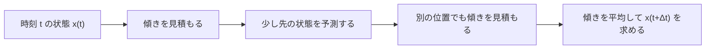
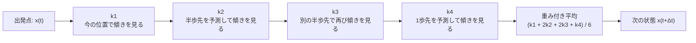

:::set layout=2col side=right w=40 gap=16 fit=contain opacity=1
# 第15+回：RLC共振（RK4シミュレーション）

## 1. 導入
- テーマ：**RLC直列回路の過渡応答**（コンデンサ電圧 \(v_C(t)\) の時間変化）
- 目的：**微分方程式 → 数値解析（RK4） → グラフ表示** の流れを体験する

---

:::set layout=1col side=right w=40 gap=16 fit=contain opacity=1

## RLC直列回路の共振（概要）

- **回路の形**：電源 → R → L → C を直列に接続（同じ電流 \(i(t)\) が流れる）
- **インピーダンス（周波数応答）**：\[ Z(\omega)=R + j\left(\omega L - \frac{1}{\omega C}\right) \]
- **共振角周波数 \(\omega_0\)**：リアクタンスが相殺（\(\omega L = 1/(\omega C)\)）
  \[ \omega_0 = \frac{1}{\sqrt{(LC)}},\qquad f_0 = \frac{\omega_0}{2\pi} \]
- その結果、\(|Z(\omega)|\) が最小になり、**電流振幅が最大**になりやすい（共振）

---

:::set layout=2col side=right w=40 gap=16 fit=contain opacity=1

## 時間変化（過渡応答）と状態方程式

- 状態を \(i(t)\) と \(v_C(t)\) にすると、次の連立微分方程式になる

\[ \frac{di}{dt}=\frac{V_{in}(t)-Ri-v_C}{L} \]
\[ \frac{dv_C}{dt}=\frac{i}{C} \]

- これを **Δt 刻み**で数値的に解き、\(v_C(t)\) の変化をグラフ表示する

---

:::set layout=2col side=right w=40 gap=16 fit=contain opacity=1

## ルンゲ＝クッタ法とは

- 微分方程式は、**その瞬間の変化の速さ** を表している
- 数値計算では、時間を少しずつ進めながら、**次の状態を近似** していく
- ルンゲ＝クッタ法は、その近似をより正確に行う代表的な方法
- RK4 は、1ステップの中で **4回傾き（変化の速さ）を見て平均する** 方法と考えるとよい

### 代表的な微分方程式の例

- RC回路の電圧変化：\(\frac{dv_C}{dt}=\frac{V_{in}-v_C}{RC}\)
- 単振動（ばね・振り子の近似）：\(\frac{d^2x}{dt^2}=-\omega^2 x\)
- RLC回路では、電流 \(i(t)\) とコンデンサ電圧 \(v_C(t)\) の時間変化を連立微分方程式で表す

> **ポイント:** オイラー法は「今の傾き」を1回だけ使うのに対し、RK4 は複数回の傾きを使うので、一般に精度が良い

---

:::set layout=2col side=right w=40 gap=16 fit=contain opacity=1

## RK4（4次ルンゲ＝クッタ法）の更新式

状態 \(\mathbf{x}=[i, v_C]^T\)、右辺 \(\mathbf{f}(t,\mathbf{x})\) とすると

\[ \mathbf{k}_1=\mathbf{f}(t,\mathbf{x}) \]
\[ \mathbf{k}_2=\mathbf{f}\left(t+\frac{\Delta t}{2},\ \mathbf{x}+\frac{\Delta t}{2}\mathbf{k}_1\right) \]
\[ \mathbf{k}_3=\mathbf{f}\left(t+\frac{\Delta t}{2},\ \mathbf{x}+\frac{\Delta t}{2}\mathbf{k}_2\right) \]
\[ \mathbf{k}_4=\mathbf{f}\left(t+\Delta t,\ \mathbf{x}+\Delta t\mathbf{k}_3\right) \]
\[ \mathbf{x}(t+\Delta t)=\mathbf{x}(t)+\frac{\Delta t}{6}(\mathbf{k}_1+2\mathbf{k}_2+2\mathbf{k}_3+\mathbf{k}_4) \]

- \(k_1, k_2, k_3, k_4\) は、それぞれ少しずつ違う位置で見た「傾き」
- 最後にそれらを重み付きで平均して、次の時刻の状態を求める
- 特に \(k_2\) と \(k_3\) を2倍しているので、「途中の傾き」をやや重く見ていると考えられる

---

:::set layout=2col side=right w=40 gap=16 fit=contain opacity=1

## 今日のまとめ
- RLC直列回路では、\(\omega_0=1/\sqrt{(LC)}\) 付近で共振が起きやすい
- 過渡応答は連立微分方程式で表せる（\(i(t), v_C(t)\)）
- RK4で Δt ごとに解き、\(v_C(t)\) をグラフ表示できる

---
